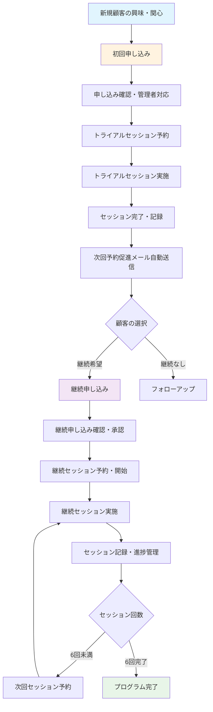

# MEC（マインドエンジニアリング・コーチング）業務フロー

## 概要
本ドキュメントは、MEC管理システムにおける業務フローを可視化し、各プロセスの詳細と関連機能を記述します。

## 業務フロー全体図

## 詳細業務フロー

### 1. 新規顧客獲得フェーズ

#### 1.1 初回申し込み
**目的**: 新規顧客からの申し込み受付

**プロセス**:
1. 顧客が申し込みページ (`/apply`) にアクセス
2. 申し込みフォーム入力
   - 基本情報（名前、メール、電話番号）
   - 申し込み動機
   - 希望日時
3. 申し込み完了 (`/apply/success`)

**システム自動処理**:
- 申し込みデータをデータベースに保存
- 申込者への確認メール自動送信
- 管理者への新規申し込み通知メール

**関連ファイル**:
- `/src/app/apply/page.tsx`
- `/src/app/apply/success/page.tsx`
- `/src/app/api/apply/route.ts`

#### 1.2 管理者対応
**目的**: 申し込み内容の確認と初期対応

**プロセス**:
1. 管理画面でクライアント管理 (`/clients`) にアクセス
2. 新規申し込みの詳細確認
3. クライアント情報の詳細編集・更新
4. トライアルセッション日程調整（手動または電話）

**管理機能**:
- クライアント一覧表示・検索
- クライアント詳細情報編集
- メモ・ノート機能

**関連ファイル**:
- `/src/app/clients/page.tsx`
- `/src/app/clients/[id]/page.tsx`

### 2. トライアルセッションフェーズ

#### 2.1 トライアルセッション予約
**目的**: 初回トライアルセッションの予約確定

**プロセス**:
1. 顧客がセッション予約ページ (`/booking`) にアクセス
2. 予約フォーム入力
   - セッション日時選択
   - セッション種別（通常はトライアル）
3. 予約完了確認 (`/booking/success`)

**システム自動処理**:
- セッション予約データをデータベースに保存
- 顧客への予約確認メール（Google Meet リンク含む）
- 管理者への新規予約通知
- セッション番号の自動採番（session_number = 1）

**関連ファイル**:
- `/src/app/booking/page.tsx`
- `/src/app/booking/success/page.tsx`
- `/src/lib/gmail.ts` (メール送信機能)

#### 2.2 セッション実施・管理
**目的**: トライアルセッションの実施と記録管理

**プロセス**:
1. 管理者がセッション管理画面 (`/sessions`) でセッション一覧確認
2. 該当セッション詳細 (`/sessions/[id]`) でセッション情報確認
3. セッション実施（Google Meet使用）
4. セッション完了後の記録入力
   - ステータスを「完了」に変更
   - セッション要約・メモ入力
   - 次回セッション案内の準備

**管理機能**:
- セッション一覧・検索・フィルタ機能
- セッション詳細編集
- メール送信履歴確認
- セッション番号管理

**関連ファイル**:
- `/src/app/sessions/page.tsx`
- `/src/app/sessions/[id]/page.tsx`

#### 2.3 セッション後フォローアップ
**目的**: セッション完了後の自動的な次回促進

**プロセス**:
1. セッション完了時、管理者が「次回予約促進メール送信」をクリック
2. メールプレビュー確認
3. メール送信実行

**システム自動処理**:
- トライアル完了者向けの継続プログラム案内メール
- メール送信履歴の自動記録
- 継続申し込みフォームへのリンク提供

**メール内容**:
- トライアルセッションのお礼
- 継続プログラムの特徴・メリット
- 継続申し込みフォームへのリンク

**関連ファイル**:
- `/src/lib/gmail.ts` (sendNextSessionPromotionEmailWithGmail)
- `/src/app/api/send-next-session-promotion/route.ts`

### 3. 継続プログラムフェーズ

#### 3.1 継続申し込み
**目的**: トライアル顧客の継続プログラム申し込み受付

**プロセス**:
1. 顧客がメールリンクから継続申し込みページにアクセス
2. 継続申し込みフォーム入力 (`/apply/continue`)
   - プログラムタイプ：6回コース（固定）
   - 希望開始日
   - 支払い方法
3. 申し込み完了 (`/apply/continue/success`)

**システム自動処理**:
- 継続申し込みデータをデータベースに保存
- 申込者への確認メール
- 管理者への継続申し込み通知

**アクセス制御**:
- メールリンク経由のみアクセス可能
- 管理者は確認目的でアクセス可能（送信は無効）

**関連ファイル**:
- `/src/app/apply/continue/page.tsx`
- `/src/app/apply/continue/success/page.tsx`
- `/src/app/api/apply/continue/route.ts`

#### 3.2 継続申し込み管理・承認
**目的**: 継続申し込みの管理と承認プロセス

**プロセス**:
1. 管理画面で継続申し込み一覧確認
2. 申し込み内容の詳細確認
3. 承認・却下の決定
4. 顧客への承認通知（手動または自動）

**管理機能**:
- 継続申し込み一覧・検索
- 申し込み詳細確認・編集
- ステータス管理（pending/approved/rejected）

**関連ファイル**:
- `/src/app/admin/continuation-applications/page.tsx`

#### 3.3 継続セッション実施
**目的**: 6回継続プログラムの実施・進捗管理

**プロセス**:
1. 継続セッションの予約・スケジューリング
2. セッション実施（2回目以降）
3. 各セッション完了後の記録
4. 進捗確認・次回セッションの調整

**システム機能**:
- セッション番号の自動管理（1-6回）
- 継続セッション向けのメール内容自動調整
- 完了回数に応じた次回予約促進メール

**メール種別**:
- 2-5回目：次回セッション予約促進
- 6回目：プログラム完了のお礼

### 4. システム管理・分析フェーズ

#### 4.1 顧客管理
**機能**:
- クライアント情報の一元管理
- セッション履歴の確認
- 支払い状況の管理
- コミュニケーション履歴

#### 4.2 セッション管理
**機能**:
- セッション予約の一覧・検索
- セッション詳細の編集
- ステータス管理（予定/実施済み/キャンセル）
- メール送信履歴の確認

#### 4.3 メール管理
**機能**:
- メール送信履歴の記録・確認
- メール送信ステータス管理
- エラー発生時の追跡

#### 4.4 支払い管理
**機能**:
- 支払い状況の管理
- 請求書発行機能（将来実装予定）

## データベース構造

### 主要テーブル

#### clients（クライアント）
- 基本情報（名前、メール、電話番号等）
- 申し込み動機・背景情報
- 作成日時・更新日時

#### sessions（セッション）
- クライアントID（外部キー）
- セッション種別（trial/regular）
- セッション番号（1-6回）
- 予約日時・ステータス
- セッション要約・メモ
- Google Meet リンク

#### continuation_applications（継続申し込み）
- クライアントID（外部キー）
- トライアルセッションID（外部キー）
- プログラムタイプ（6sessions固定）
- 希望開始日・支払い方法
- 申し込みステータス

#### email_history（メール送信履歴）
- セッションID・クライアントID（外部キー）
- メール種別・件名・宛先
- 送信ステータス・送信日時
- エラーメッセージ

## 外部サービス連携

### Gmail SMTP
- メール送信機能
- キャリアメール対応の最適化
- レート制限対応

### Supabase
- データベース管理
- 認証・認可機能
- リアルタイムデータ同期

### Google Meet
- オンラインセッションの実施
- 自動リンク生成・共有

## セキュリティ・アクセス制御

### 管理画面
- 認証済みユーザーのみアクセス可能
- Row Level Security (RLS) 設定
- セッションベースの認証

### 外部フォーム
- CSRF対策
- バリデーション機能
- レート制限

### データ保護
- 個人情報の暗号化
- アクセスログの記録
- データバックアップ

## 運用・監視

### メール送信監視
- 送信成功・失敗の記録
- エラー発生時のアラート
- 送信履歴の確認機能

### システム監視
- アプリケーション稼働状況
- データベース接続状況
- エラーログの収集

## 今後の拡張予定

### 機能拡張
- 支払い処理の自動化
- カレンダー連携
- レポート・分析機能
- モバイルアプリ対応

### 業務効率化
- 自動リマインダー機能
- テンプレート管理
- ワークフロー自動化
- AI活用による顧客分析

---

## 関連ファイル一覧

### フロントエンド（ページ）
- `/src/app/apply/page.tsx` - 初回申し込みフォーム
- `/src/app/apply/continue/page.tsx` - 継続申し込みフォーム
- `/src/app/booking/page.tsx` - セッション予約フォーム
- `/src/app/clients/page.tsx` - クライアント管理
- `/src/app/sessions/page.tsx` - セッション管理
- `/src/app/sessions/[id]/page.tsx` - セッション詳細
- `/src/components/Navigation.tsx` - ナビゲーション

### バックエンド（API）
- `/src/app/api/apply/route.ts` - 初回申し込み処理
- `/src/app/api/apply/continue/route.ts` - 継続申し込み処理
- `/src/app/api/send-next-session-promotion/route.ts` - メール送信API
- `/src/lib/gmail.ts` - メール送信ライブラリ

### データベース
- `create_continuation_applications_table.sql` - 継続申し込みテーブル
- `add_session_number_field.sql` - セッション番号フィールド追加

このドキュメントは、MEC業務の全体的な流れとシステムの機能を理解するためのガイドとして作成されました。