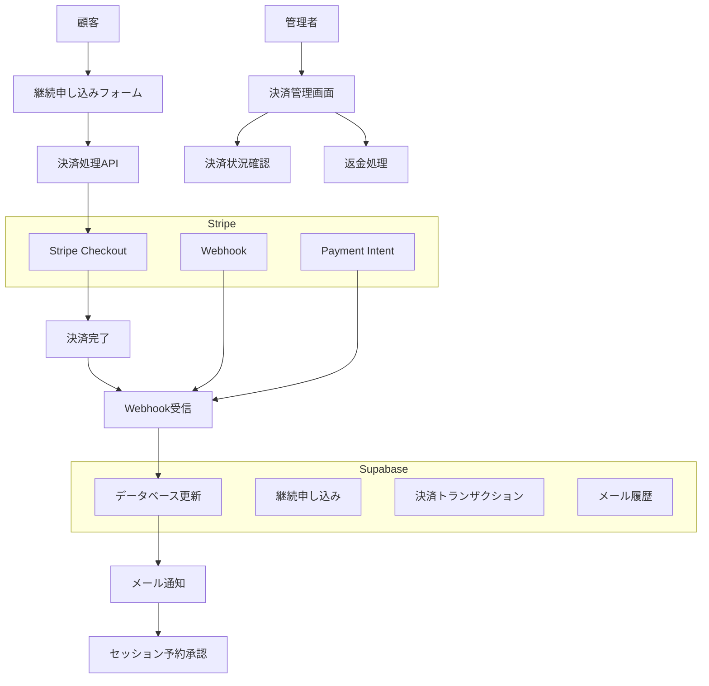
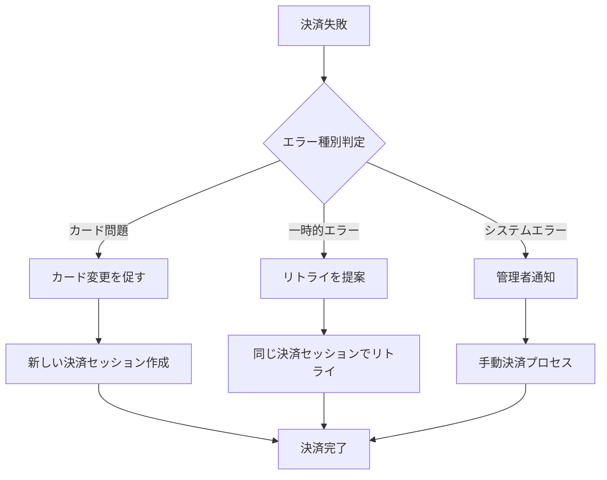

# MEC管理システム Stripe決済機能 システム設計書

## システム概要

### 現在のシステム構成
- **フレームワーク**: Next.js 14 + TypeScript
- **データベース**: Supabase (PostgreSQL)
- **認証**: Supabase Auth
- **メール送信**: Gmail SMTP
- **Google連携**: Google Meet + Calendar API

### Stripe統合の目的
継続プログラム申し込み時の決済自動化により、手動処理を削減し顧客体験を向上させる。

---

## システムアーキテクチャ



---

## データベース設計

### 1. 継続申し込みテーブル拡張

#### continuation_applications テーブル更新
```sql
-- 既存フィールドに追加
ALTER TABLE continuation_applications ADD COLUMN IF NOT EXISTS
    stripe_checkout_session_id VARCHAR(255),
    stripe_payment_intent_id VARCHAR(255),
    payment_status VARCHAR(50) DEFAULT 'pending',
    payment_amount INTEGER,
    payment_currency VARCHAR(3) DEFAULT 'JPY',
    paid_at TIMESTAMP WITH TIME ZONE,
    payment_method_type VARCHAR(50),
    stripe_customer_id VARCHAR(255);

-- インデックス追加
CREATE INDEX IF NOT EXISTS idx_continuation_applications_stripe_checkout 
    ON continuation_applications(stripe_checkout_session_id);
CREATE INDEX IF NOT EXISTS idx_continuation_applications_payment_status 
    ON continuation_applications(payment_status);
CREATE INDEX IF NOT EXISTS idx_continuation_applications_stripe_customer 
    ON continuation_applications(stripe_customer_id);
```

#### payment_status の値
- `pending`: 決済待ち
- `processing`: 決済処理中
- `succeeded`: 決済成功
- `failed`: 決済失敗
- `cancelled`: キャンセル
- `refunded`: 返金済み

### 2. 決済トランザクションテーブル新設

```sql
CREATE TABLE payment_transactions (
    id UUID DEFAULT gen_random_uuid() PRIMARY KEY,
    continuation_application_id UUID REFERENCES continuation_applications(id) ON DELETE CASCADE,
    stripe_checkout_session_id VARCHAR(255),
    stripe_payment_intent_id VARCHAR(255),
    stripe_charge_id VARCHAR(255),
    amount INTEGER NOT NULL,
    currency VARCHAR(3) DEFAULT 'JPY',
    status VARCHAR(50) NOT NULL,
    payment_method_type VARCHAR(50),
    payment_method_brand VARCHAR(50),
    payment_method_last4 VARCHAR(4),
    failure_code VARCHAR(100),
    failure_message TEXT,
    stripe_fee INTEGER,
    net_amount INTEGER,
    created_at TIMESTAMP WITH TIME ZONE DEFAULT NOW(),
    updated_at TIMESTAMP WITH TIME ZONE DEFAULT NOW()
);

-- インデックス
CREATE INDEX idx_payment_transactions_application ON payment_transactions(continuation_application_id);
CREATE INDEX idx_payment_transactions_stripe_session ON payment_transactions(stripe_checkout_session_id);
CREATE INDEX idx_payment_transactions_stripe_intent ON payment_transactions(stripe_payment_intent_id);
CREATE INDEX idx_payment_transactions_status ON payment_transactions(status);
```

### 3. Stripeカスタマーテーブル新設

```sql
CREATE TABLE stripe_customers (
    id UUID DEFAULT gen_random_uuid() PRIMARY KEY,
    client_id UUID REFERENCES clients(id) ON DELETE CASCADE,
    stripe_customer_id VARCHAR(255) UNIQUE NOT NULL,
    email VARCHAR(255) NOT NULL,
    name VARCHAR(255),
    created_at TIMESTAMP WITH TIME ZONE DEFAULT NOW(),
    updated_at TIMESTAMP WITH TIME ZONE DEFAULT NOW()
);

-- インデックス
CREATE INDEX idx_stripe_customers_client ON stripe_customers(client_id);
CREATE INDEX idx_stripe_customers_stripe_id ON stripe_customers(stripe_customer_id);
```

### 4. TypeScript型定義更新

#### `/src/types/index.ts` に追加
```typescript
// 既存のContinuationApplicationに追加
export interface ContinuationApplication {
  // ... 既存フィールド
  stripe_checkout_session_id?: string;
  stripe_payment_intent_id?: string;
  payment_status: 'pending' | 'processing' | 'succeeded' | 'failed' | 'cancelled' | 'refunded';
  payment_amount?: number;
  payment_currency?: string;
  paid_at?: string;
  payment_method_type?: string;
  stripe_customer_id?: string;
}

// 新規型定義
export interface PaymentTransaction {
  id: string;
  continuation_application_id: string;
  stripe_checkout_session_id?: string;
  stripe_payment_intent_id?: string;
  stripe_charge_id?: string;
  amount: number;
  currency: string;
  status: 'pending' | 'processing' | 'succeeded' | 'failed' | 'cancelled' | 'refunded';
  payment_method_type?: string;
  payment_method_brand?: string;
  payment_method_last4?: string;
  failure_code?: string;
  failure_message?: string;
  stripe_fee?: number;
  net_amount?: number;
  created_at: string;
  updated_at: string;
}

export interface StripeCustomer {
  id: string;
  client_id: string;
  stripe_customer_id: string;
  email: string;
  name?: string;
  created_at: string;
  updated_at: string;
}

export interface PaymentIntentData {
  sessionId: string;
  amount: number;
  currency: string;
  customer_email: string;
  metadata: {
    continuation_application_id: string;
    client_id: string;
  };
}
```

---

## API設計

### 1. Stripe Checkout Session作成API

#### `/src/app/api/stripe/create-checkout-session/route.ts`
```typescript
interface CreateCheckoutRequest {
  continuationApplicationId: string;
  priceId?: string; // オプション：異なる価格プランの場合
}

interface CreateCheckoutResponse {
  sessionId: string;
  url: string;
}

// POST /api/stripe/create-checkout-session
export async function POST(request: NextRequest): Promise<NextResponse<CreateCheckoutResponse>>
```

### 2. 決済検証API

#### `/src/app/api/stripe/verify-payment/route.ts`
```typescript
interface VerifyPaymentRequest {
  session_id: string;
}

interface VerifyPaymentResponse {
  success: boolean;
  status: string;
  payment_intent_id?: string;
  amount?: number;
}

// GET /api/stripe/verify-payment?session_id=xxx
export async function GET(request: NextRequest): Promise<NextResponse<VerifyPaymentResponse>>
```

### 3. Webhook受信API

#### `/src/app/api/stripe/webhook/route.ts`
```typescript
interface WebhookEvent {
  type: string;
  data: {
    object: any;
  };
}

// POST /api/stripe/webhook
export async function POST(request: NextRequest): Promise<NextResponse>
```

### 4. 決済管理API

#### `/src/app/api/payments/route.ts`
```typescript
interface PaymentListResponse {
  payments: PaymentTransaction[];
  total: number;
  page: number;
  per_page: number;
}

// GET /api/payments?page=1&per_page=20&status=succeeded
export async function GET(request: NextRequest): Promise<NextResponse<PaymentListResponse>>
```

#### `/src/app/api/payments/[id]/refund/route.ts`
```typescript
interface RefundRequest {
  amount?: number; // 部分返金の場合
  reason?: string;
}

interface RefundResponse {
  success: boolean;
  refund_id: string;
  amount: number;
}

// POST /api/payments/[id]/refund
export async function POST(request: NextRequest): Promise<NextResponse<RefundResponse>>
```

---

## フロントエンド設計

### 1. 継続申し込み画面更新

#### `/src/app/apply/continue/page.tsx`

**既存の変更点:**
- 決済ボタンの追加
- Stripe Checkout統合
- エラーハンドリング強化
- ローディング状態管理

**新機能:**
```typescript
interface ContinueApplicationState {
  formData: ContinuationApplicationForm;
  isSubmitting: boolean;
  paymentStatus: 'idle' | 'processing' | 'succeeded' | 'failed';
  error: string | null;
}

// 決済処理フロー
const handlePaymentSubmit = async () => {
  1. フォームバリデーション
  2. 継続申し込みデータ保存
  3. Stripe Checkout Session作成
  4. Stripe Checkoutページにリダイレクト
}
```

### 2. 決済成功・失敗画面

#### `/src/app/apply/continue/success/page.tsx`
```typescript
interface PaymentSuccessPageProps {
  searchParams: {
    session_id: string;
  };
}

// 決済確認フロー
useEffect(() => {
  1. URLのsession_idを取得
  2. 決済状況をAPIで確認
  3. 結果に応じて表示を変更
  4. 自動リダイレクト（5秒後）
}, [session_id]);
```

#### `/src/app/apply/continue/cancel/page.tsx`
```typescript
// 決済キャンセル時の処理
// - 申し込みデータの保持
// - 再決済の案内
// - 手動決済オプション
```

### 3. 決済管理画面

#### `/src/app/admin/payments/page.tsx`
```typescript
interface PaymentManagementState {
  payments: PaymentTransaction[];
  filters: {
    status: string[];
    dateRange: [Date, Date];
    searchQuery: string;
  };
  pagination: {
    page: number;
    per_page: number;
    total: number;
  };
}

// 機能
- 決済一覧表示
- フィルタリング・検索
- 決済詳細モーダル
- 返金処理
- CSV出力
```

#### `/src/app/admin/payments/[id]/page.tsx`
```typescript
// 決済詳細画面
interface PaymentDetailProps {
  params: { id: string };
}

// 表示情報
- 決済基本情報
- 顧客情報
- 継続申し込み情報
- Stripe情報
- 返金履歴
- 関連メール履歴
```

### 4. 共通コンポーネント

#### `/src/components/PaymentStatus.tsx`
```typescript
interface PaymentStatusProps {
  status: PaymentTransaction['status'];
  amount?: number;
  currency?: string;
}

// ステータス表示コンポーネント
// - 色分け表示
// - アイコン表示
// - 金額フォーマット
```

#### `/src/components/StripeElements.tsx`
```typescript
// Stripe Elements wrapper
import { Elements } from '@stripe/react-stripe-js';

interface StripeElementsProviderProps {
  children: React.ReactNode;
  options?: any;
}
```

---

## セキュリティ設計

### 1. 環境変数管理

```env
# Stripe本番環境
STRIPE_SECRET_KEY=sk_live_xxx
NEXT_PUBLIC_STRIPE_PUBLISHABLE_KEY=pk_live_xxx
STRIPE_WEBHOOK_SECRET=whsec_xxx

# Stripe商品設定
STRIPE_PRICE_ID=price_xxx
STRIPE_SUCCESS_URL=https://yourdomain.com/apply/continue/success
STRIPE_CANCEL_URL=https://yourdomain.com/apply/continue/cancel
```

### 2. Webhook署名検証

```typescript
// 必須：全てのWebhookでStripe署名を検証
const sig = headers().get('stripe-signature');
const event = stripe.webhooks.constructEvent(body, sig, process.env.STRIPE_WEBHOOK_SECRET);
```

### 3. データバリデーション

```typescript
// Zod スキーマ定義
import { z } from 'zod';

const ContinuationApplicationSchema = z.object({
  client_id: z.string().uuid(),
  program_type: z.literal('6sessions'),
  preferred_start_date: z.string().optional(),
  payment_method: z.enum(['card', 'bank_transfer']),
});

const CreateCheckoutSchema = z.object({
  continuationApplicationId: z.string().uuid(),
  priceId: z.string().optional(),
});
```

### 4. CORS設定

```typescript
// API Routeでのアクセス制御
export async function POST(request: NextRequest) {
  const origin = request.headers.get('origin');
  
  if (process.env.NODE_ENV === 'production') {
    if (origin !== process.env.NEXT_PUBLIC_APP_URL) {
      return NextResponse.json({ error: 'Forbidden' }, { status: 403 });
    }
  }
}
```

### 5. レート制限

```typescript
// 決済API用レート制限
const rateLimit = {
  '/api/stripe/create-checkout-session': '5 requests per minute',
  '/api/stripe/webhook': 'unlimited (Stripe signature required)',
  '/api/payments': '60 requests per hour',
};
```

---

## エラーハンドリング

### 1. Stripe エラー分類

```typescript
interface StripeErrorHandler {
  card_declined: (error: Stripe.StripeCardError) => UserMessage;
  processing_error: (error: Stripe.StripeError) => UserMessage;
  authentication_required: (error: Stripe.StripeError) => UserMessage;
}

const stripeErrorMessages = {
  card_declined: 'カードが拒否されました。別のカードをお試しください。',
  insufficient_funds: '残高不足です。',
  expired_card: 'カードの有効期限が切れています。',
  incorrect_cvc: 'セキュリティコードが正しくありません。',
  processing_error: '決済処理中にエラーが発生しました。',
  generic_decline: 'カードが拒否されました。カード発行会社にお問い合わせください。',
};
```

### 2. 決済失敗時の復旧フロー



### 3. ログ記録戦略

```typescript
interface PaymentLog {
  level: 'info' | 'warn' | 'error';
  event: string;
  data: {
    continuation_application_id?: string;
    stripe_session_id?: string;
    error_code?: string;
    user_agent?: string;
    ip_address?: string;
  };
  timestamp: string;
}

// ログ記録ポイント
- 決済セッション作成
- 決済開始
- 決済完了
- 決済失敗
- Webhook受信
- 返金処理
```

---

## 運用・監視

### 1. ダッシュボード設計

#### 決済ダッシュボード項目
```typescript
interface PaymentDashboard {
  dailyStats: {
    total_amount: number;
    successful_payments: number;
    failed_payments: number;
    refunded_amount: number;
  };
  monthlyTrends: PaymentTrend[];
  recentTransactions: PaymentTransaction[];
  errorSummary: ErrorSummary[];
}
```

### 2. アラート設定

```typescript
interface AlertConditions {
  payment_failure_rate: number; // 失敗率が20%超過
  webhook_delay: number; // Webhook受信が5分遅延
  daily_amount_drop: number; // 日次売上が50%低下
  consecutive_failures: number; // 連続失敗が5回
}
```

### 3. バックアップ・復旧

```sql
-- 決済データのバックアップ戦略
-- 1. 日次バックアップ（継続申し込み + 決済トランザクション）
-- 2. リアルタイム複製（本番 → 監視用DB）
-- 3. 週次アーカイブ（過去データの圧縮保存）

-- 復旧手順
-- 1. Stripe webhookの再送信
-- 2. 決済状況の手動同期
-- 3. 顧客への状況通知
```

---

## テスト戦略

### 1. 単体テスト

```typescript
// __tests__/stripe-integration.test.ts
describe('Stripe Integration', () => {
  test('Checkout session creation', async () => {
    const response = await createCheckoutSession({
      continuationApplicationId: 'test-id',
    });
    expect(response.sessionId).toBeDefined();
  });

  test('Webhook signature verification', async () => {
    const event = constructTestWebhookEvent();
    const isValid = verifyWebhookSignature(event);
    expect(isValid).toBe(true);
  });
});
```

### 2. 結合テスト

```typescript
// __tests__/payment-flow.integration.test.ts
describe('Payment Flow Integration', () => {
  test('Complete payment flow', async () => {
    // 1. 継続申し込み作成
    // 2. 決済セッション作成
    // 3. テスト決済実行
    // 4. Webhook受信
    // 5. データベース更新確認
    // 6. メール送信確認
  });
});
```

### 3. E2Eテスト

```typescript
// e2e/payment.spec.ts
test('User can complete payment for continuation program', async ({ page }) => {
  await page.goto('/apply/continue?email=test@example.com');
  await page.fill('[name="preferred_start_date"]', '2024-01-01');
  await page.click('[data-testid="payment-button"]');
  
  // Stripe Checkoutページ
  await page.fill('[name="cardNumber"]', '4242424242424242');
  await page.fill('[name="cardExpiry"]', '12/25');
  await page.fill('[name="cardCvc"]', '123');
  await page.click('[data-testid="submit-payment"]');
  
  // 成功ページ確認
  await expect(page.locator('[data-testid="payment-success"]')).toBeVisible();
});
```

---

## パフォーマンス最適化

### 1. データベース最適化

```sql
-- インデックス戦略
CREATE INDEX CONCURRENTLY idx_continuation_applications_payment_lookup 
    ON continuation_applications(client_id, payment_status, created_at);

-- パーティショニング（大量データ対応）
CREATE TABLE payment_transactions_y2024m01 PARTITION OF payment_transactions
    FOR VALUES FROM ('2024-01-01') TO ('2024-02-01');
```

### 2. API最適化

```typescript
// キャッシュ戦略
export const revalidate = 300; // 5分キャッシュ

// 並列処理
const [customer, application] = await Promise.all([
  stripe.customers.retrieve(customerId),
  fetchContinuationApplication(applicationId),
]);
```

### 3. フロントエンド最適化

```typescript
// 遅延読み込み
const PaymentManagement = lazy(() => import('./PaymentManagement'));

// Stripe Elements最適化
const stripePromise = loadStripe(publishableKey, {
  locale: 'ja',
  fonts: [{ cssSrc: 'https://fonts.googleapis.com/css?family=Roboto' }],
});
```

---

## 実装優先順位

### フェーズ1: 基本決済機能（1-2週間）
1. データベーススキーマ更新
2. Stripe基本設定
3. Checkout Session API実装
4. 継続申し込み画面更新
5. Webhook基本実装

### フェーズ2: 管理機能（1週間）
1. 決済管理画面
2. 決済詳細表示
3. 基本的なエラーハンドリング
4. テスト環境での動作確認

### フェーズ3: 運用機能（1週間）
1. 返金機能
2. ダッシュボード
3. アラート機能
4. ログ記録強化

### フェーズ4: 最適化・拡張（継続的）
1. パフォーマンス最適化
2. 追加決済手段
3. 分析レポート
4. 自動化機能

---

この設計書に基づいて、段階的にStripe決済機能を実装していきます。どのフェーズから開始しますか？